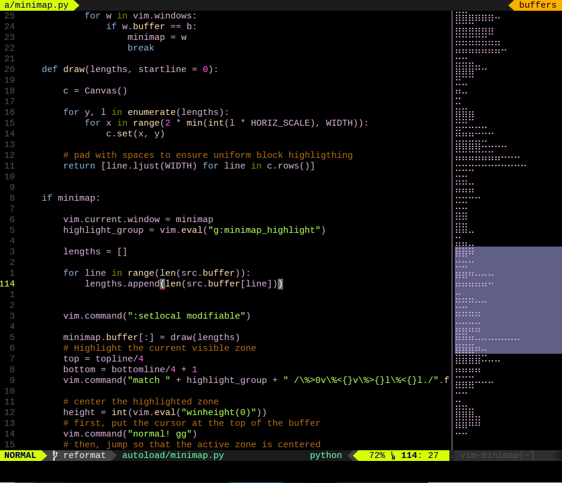

A code minimap for Vim
======================

The Sublime text-editor can display an useful overview of the code as a
*minimap* sidebar.

We can implement the same thing in Vim, relying on the [Drawille
library](https://github.com/asciimoo/drawille) to 'draw' in text mode.

**Attention**: this extension is not yet ready for general use! Only a few
features are implemented and it's likely full of bugs. Patches welcome!

Features
--------

- displays the minimap of the currently active buffer (and updates when
  switching to a different buffer)
- synchronized scrolling
- live update while typing

Installation
------------

With [vundle](https://github.com/gmarik/Vundle.vim), simply add: `Bundle
'severin-lemaignan/vim-minimap'` to your `.vimrc` and run `BundleInstall` from
vim.

Note that this extension requires Vim with Python support.

Usage
-----

`:Minimap` to show the minimap, `:MinimapClose` to hide it.

Default mappings: `<Leader>mm` to display the minimap, `<Leader>mc` to close it.

Settings
--------

You can customize the color of the highlighting by setting `g:minimap_highlight` in your vimrc:

`let g:minimap_highlight='Visual'`

Note: To find out which highlights are available on your vim installation use :hi to get the list.

